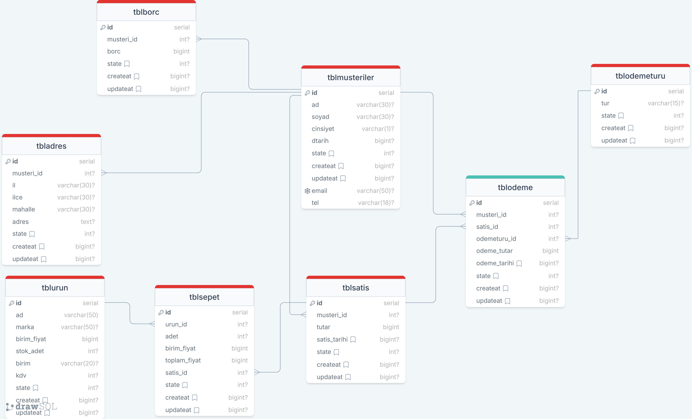

# create tblmusteri

```sql
CREATE TABLE public.tblmusteriler
(
    id serial,
    ad character varying(30) NOT NULL,
    soyad bit varying(30) NOT NULL,
    cinsiyet character varying(1) NOT NULL,
    dtarih bigint NOT NULL,
    state integer NOT NULL DEFAULT 1,
    createAt bigint DEFAULT EXTRACT(epoch from Now()),
	updateAt bigint DEFAULT EXTRACT(epoch from Now()),
    email character varying(50) NOT NULL,
    tel character varying(18) NOT NULL,
    PRIMARY KEY (id),
    CONSTRAINT "musteriEmail" UNIQUE (email)
);

ALTER TABLE IF EXISTS public.tblmusteriler
    OWNER to postgres;
```

# create tblborc

```sql
CREATE TABLE public.tblborc
(
    id serial,
    musteri_id int NOT NULL,
    borc bigint,
    state integer NOT NULL DEFAULT 1,
    createAt bigint DEFAULT EXTRACT(epoch from Now()),
	updateAt bigint DEFAULT EXTRACT(epoch from Now()),
    PRIMARY KEY (id)
);

ALTER TABLE IF EXISTS public.tblmusteriler
    OWNER to postgres;
```

# create tbladres

```sql
CREATE TABLE public.tbladres
(
    id serial,
    musteri_id int NOT NULL,
	il varchar(30) NOT NULL,
	ilce varchar(30) NOT NULL,
	mahalle varchar(30) NOT NULL,
	adres text NOT NULL,
    state integer NOT NULL DEFAULT 1,
    createAt bigint DEFAULT EXTRACT(epoch from Now()),
	updateAt bigint DEFAULT EXTRACT(epoch from Now()),
    PRIMARY KEY (id)
);

ALTER TABLE IF EXISTS public.tblmusteriler
    OWNER to postgres;
```

# create tblurun

```sql
CREATE TABLE public.tblurun
(
    id serial,
	ad varchar(50),
	marka varchar(50) NOT NULL,
	birim_fiyat bigint,
	stok_adet int NOT NULL,
	birim varchar(20) NOT NULL,
	kdv int NOT NULL,
    state integer NOT NULL DEFAULT 1,
    createAt bigint DEFAULT EXTRACT(epoch from Now()),
	updateAt bigint DEFAULT EXTRACT(epoch from Now()),
    PRIMARY KEY (id)
);

ALTER TABLE IF EXISTS public.tblmusteriler
    OWNER to postgres;
```

# crate tblsepet

```sql
CREATE TABLE public.tblsepet
(
    id serial,
	urun_id int NOT NULL,
	adet int NOT NULL,
	birim_fiyat bigint,
	toplam_fiyat bigint,
	satis_id int NOT NULL,
    state integer NOT NULL DEFAULT 1,
    createAt bigint DEFAULT EXTRACT(epoch from Now()),
	updateAt bigint DEFAULT EXTRACT(epoch from Now()),
    PRIMARY KEY (id)
);

ALTER TABLE IF EXISTS public.tblmusteriler
    OWNER to postgres;
```
# create tblsatis

```sql
CREATE TABLE public.tblsatis
(
    id serial,
	musteri_id int NOT NULL,
	tutar bigint,
	satis_tarihi bigint NOT NULL DEFAULT EXTRACT(epoch from Now()),
    state integer NOT NULL DEFAULT 1,
    createAt bigint DEFAULT EXTRACT(epoch from Now()),
	updateAt bigint DEFAULT EXTRACT(epoch from Now()),
    PRIMARY KEY (id)
);

ALTER TABLE IF EXISTS public.tblmusteriler
    OWNER to postgres;
```

# create tblodeme

```sql

CREATE TABLE public.tblodeme
(
    id serial,
	musteri_id int NOT NULL,
	satis_id int NOT NULL,
	odemeturu_id int NOT NULL,
	odeme_tutar bigint,
	odeme_tarihi bigint NOT NULL DEFAULT EXTRACT(epoch from Now()),
    state integer NOT NULL DEFAULT 1,
    createAt bigint DEFAULT EXTRACT(epoch from Now()),
	updateAt bigint DEFAULT EXTRACT(epoch from Now()),
    PRIMARY KEY (id)
);

ALTER TABLE IF EXISTS public.tblmusteriler
    OWNER to postgres;
```

# create tblodemeturu

```sql
CREATE TABLE public.tblodemeturu
(
    id serial,
	tur varchar(15) NOT NULL,
    state integer NOT NULL DEFAULT 1,
    createAt bigint DEFAULT EXTRACT(epoch from Now()),
	updateAt bigint DEFAULT EXTRACT(epoch from Now()),
    PRIMARY KEY (id)
);

ALTER TABLE IF EXISTS public.tblmusteriler
    OWNER to postgres;
```

## İLİŞKİLENDİRME

# tblmusteriler - tbladres  ilişkilendirme
```sql
ALTER TABLE public.tbladres
    ADD CONSTRAINT musteri_no FOREIGN KEY (musteri_id)
    REFERENCES public.tblmusteriler (id)
    ON UPDATE CASCADE
    ON DELETE CASCADE;
```
# tblmusteriler - tblborc  ilişkilendirme
```sql
ALTER TABLE public.tblborc
    ADD CONSTRAINT musteri_no FOREIGN KEY (musteri_id)
    REFERENCES public.tblmusteriler (id)
    ON UPDATE CASCADE
    ON DELETE CASCADE;
```
# tblodeme- tblodemeturu-tblmusteriler-tblsatis  ilişkilendirme
```sql
ALTER TABLE public.tblodeme
    ADD CONSTRAINT musteri_no FOREIGN KEY (musteri_id)
    REFERENCES public.tblmusteriler (id)
    ON UPDATE CASCADE
    ON DELETE CASCADE;

ALTER TABLE public.tblodeme
    ADD CONSTRAINT satis_no FOREIGN KEY (satis_id)
    REFERENCES public.tblsatis (id)
    ON UPDATE CASCADE
    ON DELETE CASCADE;

ALTER TABLE public.tblodeme
    ADD CONSTRAINT odeme_turu_no FOREIGN KEY (odemeturu_id)
    REFERENCES public.tblodemeturu (id)
    ON UPDATE CASCADE
    ON DELETE CASCADE;
```
# tblsatis-tblmusteriler ilişkilendirme

```sql
ALTER TABLE public.tblsatis
    ADD CONSTRAINT musteri_no FOREIGN KEY (musteri_id)
    REFERENCES public.tblmusteriler (id)
    ON UPDATE CASCADE
    ON DELETE CASCADE;
```

# tblsepet-tblurun-tblsatis ilişkilendirme

```sql
ALTER TABLE public.tblsepet
    ADD CONSTRAINT urun_numarasi FOREIGN KEY (urun_id)
    REFERENCES public.tblurun (id)
    ON UPDATE CASCADE
    ON DELETE CASCADE;

ALTER TABLE public.tblsepet
    ADD CONSTRAINT satis_no FOREIGN KEY (satis_id)
    REFERENCES public.tblsatis (id)
    ON UPDATE CASCADE
    ON DELETE CASCADE;
```